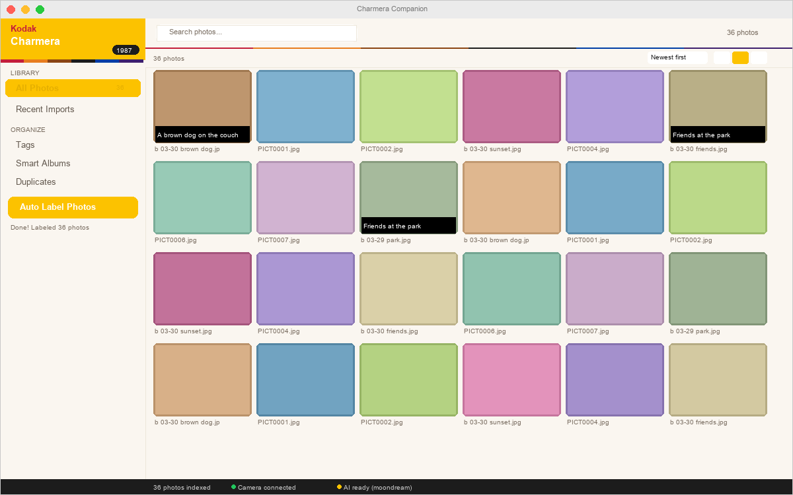
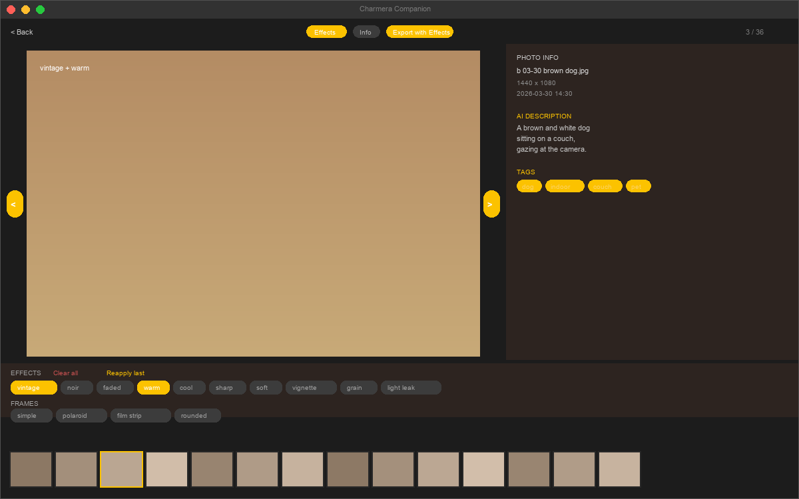

<p align="center">
  
</p>

<h1 align="center">Charmera Companion</h1>

<p align="center">
  <strong>Desktop photo organizer with local AI for the KODAK CHARMERA keychain camera</strong>
</p>

<p align="center">
  <a href="https://www.rust-lang.org/"></a>
  <a href="https://v2.tauri.app/"></a>
  <a href="https://www.solidjs.com/"></a>
  <a href="https://ollama.com/"></a>
  <a href="LICENSE"></a>
  <a href="https://github.com/h3qing/Kodak-Charmera-Companion/actions"></a>
</p>

<p align="center">
  <em>Import, label, rename, and enhance photos from your keychain camera — all locally, no cloud required.</em>
</p>

---

> **v0.2.1** — Vintage Kodak 1987 UI, auto AI labeling, smart albums, drag-and-drop, duplicate detection, 22 tests. [Changelog](CHANGELOG.md)

<p align="center">
  
</p>

<details>
<summary><strong>Photo Detail View</strong> — effects, AI labels, film strip navigation</summary>
<p align="center">
  
</p>
</details>

## The Problem

You bought a cute KODAK CHARMERA (or similar keychain camera). It takes fun photos. But the files are named `PICT0042.jpg`, there's no metadata, and organizing them is painful.

## The Solution

Plug in your camera, and Charmera Companion **automatically imports, labels, and renames** your photos using a local AI model running entirely on your machine. No cloud uploads. No API keys. No subscriptions.

```
Camera connected → Import 36 photos → AI: "A brown dog on the couch" → b 03-30-2026 brown dog on couch.jpg
```

## Features

### Auto-Import & Label
Plug in your camera and a popup appears. Click "Import" and photos are automatically analyzed by a local vision model. Supports multiple Ollama models — **moondream** (fast, 1B), **llava** (better quality, 7B), **bakllava**, and more. The app auto-selects the best available model. You can also **drag and drop** any folder onto the app to import.

### Smart File Renaming
Configure your naming pattern: `b {MM}-{DD}-{YYYY} {content}` transforms `PICT0042.jpg` into `b 03-30-2026 sunset at the beach.jpg`. Files are renamed directly on the SD card.

### Browse & Search
Search photos by AI-generated descriptions and tags. Click a tag to filter. Full-text search across your entire library.

### Photo Effects & Frames
Apply vintage film effects and frames before exporting:

| Effects | Frames |
|---------|--------|
| vintage, noir, faded, warm, cool | polaroid, film strip |
| sharp, soft, vignette, grain, light leak | simple, rounded |

### Drag & Drop
Drop any folder onto the app window to import photos. A bright yellow overlay appears — release to start importing.

### Duplicate Detection
Find identical photos by file hash. Keep the original, hide the duplicates (files stay on disk).

### Settings & Customization
- Configurable naming pattern with live preview
- Token buttons: `{MM}` `{DD}` `{YYYY}` `{content}` `{counter}` `{original}`
- AI status monitoring
- Boot splash screen editor for your camera

### Keyboard Shortcuts

| Shortcut | Action |
|----------|--------|
| `Cmd+1` | All Photos |
| `Cmd+2` | Recent Imports |
| `Cmd+3` | Tags |
| `Cmd+4` | Duplicates |
| `Cmd+F` | Focus search |
| `Cmd+,` | Settings |
| `E` | Toggle effects (in photo detail) |
| `I` | Toggle info panel (in photo detail) |
| `←` `→` | Navigate photos |
| `C` | Compare (before/after effects) |
| `Esc` | Back to grid |

## Architecture

```
Tauri 2 Desktop App
├── Frontend: Solid.js + Tailwind CSS v4
│   ├── Vintage Kodak 1987 design system
│   ├── Camera auto-detect + import popup
│   ├── Photo grid with film frame styling
│   └── Settings with naming pattern editor
│
└── Backend: Rust (3 crates)
    ├── charmera-core (library)
    │   ├── ai         → Ollama/moondream vision labeling
    │   ├── catalog    → SQLite with WAL, full-text search
    │   ├── effects    → 10 effects + 4 frames pipeline
    │   ├── import     → Camera detect, file hash, smart rename
    │   ├── thumbnails → 256px sharded cache
    │   ├── splash     → Boot screen editor (960×720)
    │   └── export     → Batch JPEG pipeline
    ├── charmera-app   → Tauri commands (25 IPC endpoints)
    └── charmera-cli   → Agent-friendly CLI with --json
```

## Quick Start

### One-Line Install (macOS)

```bash
curl -fsSL https://raw.githubusercontent.com/h3qing/Kodak-Charmera-Companion/main/scripts/install.sh | bash
```

### Manual Install

Prerequisites: [Rust](https://rustup.rs/), [Bun](https://bun.sh/) or Node.js, [Ollama](https://ollama.com/)

```bash
# Clone
git clone https://github.com/h3qing/Kodak-Charmera-Companion.git
cd Kodak-Charmera-Companion

# Pull a vision model (pick one)
ollama pull moondream    # Fast, 1B params, basic descriptions
# ollama pull llava      # Better quality, 7B params (recommended if you have 8GB+ RAM)

# Install frontend deps
cd frontend && bun install && cd ..

# Run in development
cargo tauri dev
```

> **No camera?** Click "Try with sample photos" on the welcome screen to generate test images and explore all features.

### CLI (for automation & AI agents)

```bash
cargo build -p charmera-cli

# Detect camera
charmera detect --json
# → {"detected": true, "path": "/Volumes/SDCARD"}

# List photos on connected camera
charmera list --json

# Import with auto-detection
charmera import

# Label a photo with local AI
charmera label photo.jpg --json
# → {"description": "A brown dog on the couch", "tags": ["dog", "indoor", "couch"]}

# Apply effects
charmera effects photo.jpg --effects vintage,grain --frame polaroid --output edited.jpg
```

## How It Works

1. **Connect camera** — mounts as USB mass storage at `/Volumes/SDCARD`
2. **Auto-detect** — app polls every 5s, shows popup when new photos found
3. **Import** — reads DCIM folder, hashes files (blake3), generates thumbnails
4. **AI Label** — sends each thumbnail to best available Ollama vision model
5. **Tag Extract** — parses description for 55+ keyword categories
6. **Smart Rename** — applies naming pattern, renames directly on SD card
7. **Browse** — search by description, filter by tags, multi-select & export

## Compatible Cameras

Built for the **KODAK CHARMERA** (Generalplus CBB3 chipset), but works with any camera that mounts as USB mass storage with JPEG photos in a DCIM folder.

| Spec | Value |
|------|-------|
| Photos | 1440×1080 JPEG |
| Video | 1440×1080 @ 30fps MJPEG |
| Boot splash | 960×720 JPEG (`SPIDCIM/SPI00.jpg`) |
| Connection | USB mass storage |

For firmware hacking details, see [docs/hardware-guide.md](docs/hardware-guide.md).

## Design

The UI is inspired by the physical camera — bright Kodak Yellow, the iconic rainbow stripe (red → orange → black → blue → purple), and retro 1987 typography. It's designed to feel like holding the actual camera.

## Contributing

Contributions welcome! This project uses:
- **Rust** for the backend (3-crate workspace)
- **Solid.js + Tailwind v4** for the frontend
- **Tauri 2** for the desktop shell

```bash
# Run tests
cargo test

# Build frontend
cd frontend && bun run build

# Development mode
cargo tauri dev
```

## Roadmap

Planned features — star the repo to follow progress:

- [ ] **Dark mode** toggle
- [x] **Photo comparison** — side-by-side before/after effects *(v0.3.0)*
- [ ] **Face detection** — group photos by person
- [ ] **Export presets** — save favorite effect combinations
- [ ] **Linux support** — auto-detect cameras on Linux
- [ ] **Windows support** — volume detection for Windows
- [ ] **Video thumbnails** — preview AVI clips from the camera
- [x] **Batch effects** — apply effects to multiple photos at once *(v0.3.0)*
- [ ] **CLIP embeddings** — semantic photo search ("photos near the ocean")
- [ ] **iCloud/Google Photos export** — one-click cloud upload

Have an idea? [Open a discussion](https://github.com/h3qing/Kodak-Charmera-Companion/discussions) or [file a feature request](https://github.com/h3qing/Kodak-Charmera-Companion/issues/new?template=feature_request.yml).

## License

MIT — see [LICENSE](LICENSE) for details.

> Not affiliated with Kodak. KODAK and CHARMERA are trademarks of their respective owners.
